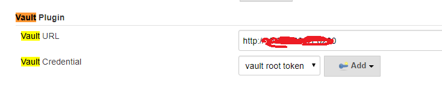
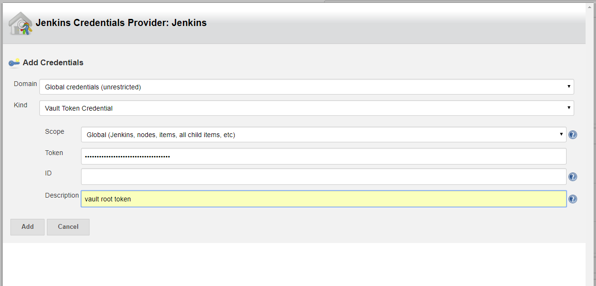
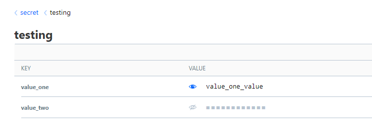
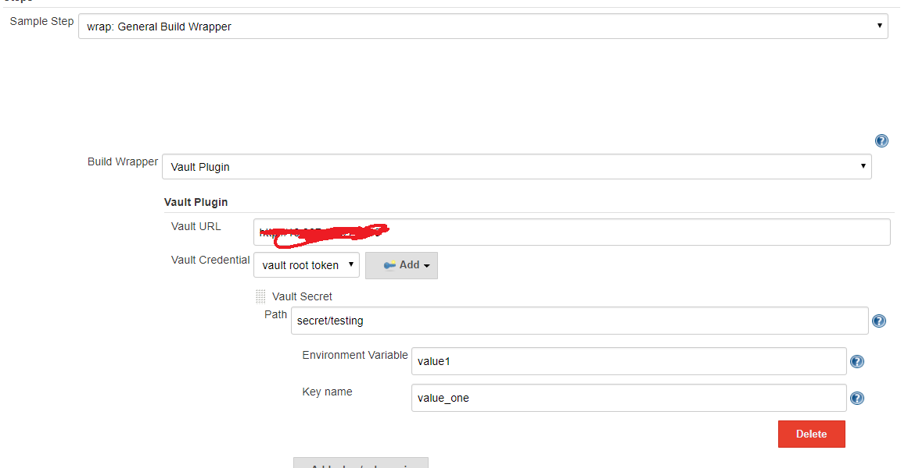

# How to integrate HashiCorp vault with Jenkins for security? #
## 1. Install vault plugin in Jenkins. ##
## 2. Click "Manage Jenkins" --> "Configure System" --> "Vault Plugin" to add below configuration. ##


Note: when you set up Vault, you will get vault root token. Above picture is using root token for vault credential.
## 3. Create job and use Vault in Jenkins job. ##
1. I add some key-value pair in Vault for testing, 

2. Use Pipeline Syntax to generate code block.

3. Copy above code block and add it in Jenkins pipeline.
```
    stage("test"){
           steps{
                script{
                wrap([$class: 'VaultBuildWrapper', configuration: [vaultCredentialId: 'vaultCredentialId', vaultUrl: 'vaultUrl'], vaultSecrets: [[path: 'secret/testing', secretValues: [[envVar: 'value1', vaultKey: 'value_one']]]]]) {    
                sh 'echo $value1'
                sh 'if [ ${value1} == \'value_one1_value\' ]; then echo \'yes\'; else echo \'no\'; fi '  
                }
            }
        }
```
4. Run job and see conse output and now the environment value has been encoded!


    